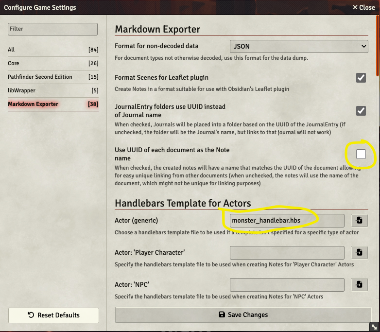
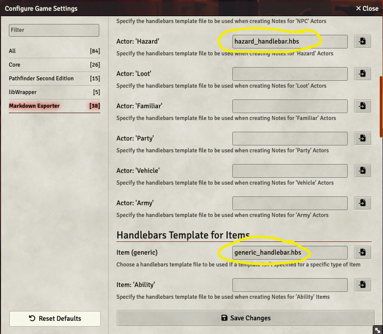
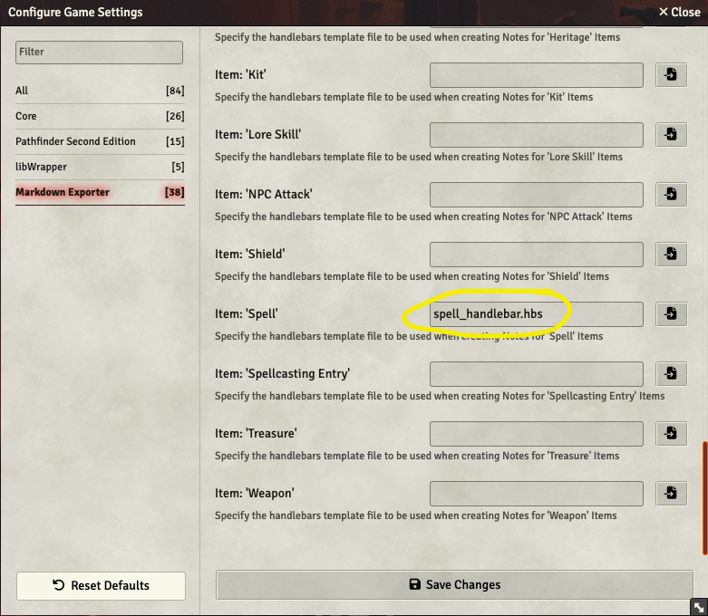

# Markdown Exporter, changes for PF2E

# Process Overview

**NOTE** This is a very rough modification to the original Markdown Exporter so it
produces more usable Pathfinder 2E Remaster content in markdown format for Obisidian.

This is NOT designed to be module that can be directly imported into Foundry.  The assumption
is you will merge these changes on top of the existing Markdown Exporter to modify its behavior. 

Detailed instructions are in the next section.  What follows here is a quick overview of the process:

Modified files to the Markdown Exporter module are:
- `scripts/export-markdown.js`
- `scripts/module-settings.js`

After you merge in the changes, you need to restart your world for the changes to the module to 
take effect..

When exporting the Pathfinder compendium, use the included `handlebars/spell_handlebar.hbs` for Spells, `monster_handlebar.hbs` as the general handlebar for Actors, `hazard_handlebar.hbs` as the handlebar for HAzard actors, and `generic_handlebar.hbs` for generic items.  You'll need to manually copy these to Foundry as the Foundry file browser does not let you interact with .hbs files, but the internal handlebar routine requires a file extension of .hbs or other appropriate handlebar-relate name, none of which you can see with the Foundry file browser. Then within Foundry enter the handlebar names in the appropriate locations in the Markdown Exporter mondule settings UI.

Included in this project is a new file `pf2e-spell.css` which is an 
Obsidian CSS snippet which can be installed in your `.obsidian/snippets` directory so the spells resemble the new style used in the Player Core and GM Core books.

# Detailed Installation Instructions

This process requires you have a Foundry account with a World with the **Pathfinder Second Edition** package selected as the Game System.


## 1. Install the following required modules:
* libWrapper
* Markdown Exporter
* More Handlebars Helpers

## 2. Apply this github package's changes to Foundry
After you have installed the above 3 packages, locate the Markdown Exporter installation in your Foundry directory.   It should be in a directory named `Data/modules/export-markdown`.  Within that directory you should see a `scripts/` folder.   Within that folder you should see the following files:
``` 
config.js		lib			render-template.js
export-markdown.js	module-settings.js
```

Copy the `export-markdown.js` and `module-settings.js` files from this github project and replace the files of the same name in the `export-markdown/scripts` directory.

Also, copy the files located in this github project's `handlebars/` folder into the `Data/` folder in your Foundry installation directory.    These handlebar files will be referenced in the next step.

## 3. Enable modules
Launch your world in Foundry, and log in as the Gamemaster account.   If you already had your world running when you performed the above steps, you will need to log out and log back in as Gamemaster for the changes to take effect.

Choose `Manage Modules` in your logged into Foundry world.  Enable these three modules you installed in step 1. 


## 4. Configure Markdown Exporter
Choose `Configure Settings` and pick Markdown Exporter. Ensure the following options are checked.   _NOTE:_ This is going to have all the items in the Pathfinder Compendium exported with unique, non-friendly filenames.  This is **required** if you want the internal links between notes to work.  We will address the non-friendly filenames with an Obsidian plugin in a later step.


Enter the 4 handlebar names in the appropriate locations:
* `monster_handlebar.hbs` goes in `Actor(generic)`
* `hazard_handlebar.hbs` goes in `Actor: 'Hazard'`
* `generic_handlebar.hbs` goes in `Item (generic)`
* `spell_handlebar.hbs` goes in `Item:'Spell'`



Click on `Save Changes`.

## 5. Export the Compendium
You are now ready to export any items from your world, including Pathfinder Compendium items.  If you want to do a quick test, choose to view a monster or spell, then choose to "import" it into your saved items.   Then, right click on that item and choose the last option in the pop-up menu named `Export to Markdown`. If everything is installed correctly, you should see a pop-up message saying it is exporting the data and then a file will be saved named after the item. If the file has multiple items associated with it will be created as a `.zip` file.

If you want to export the whole Compendium, you can go to the compendium menu and at the bottom of the screen choose `Export to Markdown`.  This will take several minutes.  If you'd like to see progress as you wait, you can open the browser debug window and the console will show messages of the items it is exporting.


## 6. Customize your Vault
The exported data requires a few extra plugins in Obsidian to be viewed in the best format.
### Install and enable the following plugins. 
* Fantasy Statblocks
* Pathfinder 2E Action Icons
* Front Matter Title 

For the Fantasy Statblocks, you can go into its settings and disable the built-in D&D 5e SRD monsters if you aren't using D&D.


The Front Matter Ttitle plugin will automatically hide filenames and replace them with the `title:` property in a note's frontmatter.  This helps hide the non-friendly unique filenames and links that Markdown Exporter generated. It will not affect any existing notes that do not have a `title:` property. 
For the Front Matter Title plugin, there are a few recommended settings:


### Install ITS
It is also recommended to install the ITS Theme so the spells look their best. Choose Obsidian Settings, `Appearance` and in the `Themes` section pick manage, search for ITS and install and use it.


### Install custom snippet
In addition copy the `pf2e-spell.css` from this github project into your `.obsidian/snippets` folder.  (If you don't already have a snippets folder, you will need to create it.)   After you copy the snippet file, go into the Obsidian settings, choose `Appearance` and scroll down to the `Snippets` section and enable this `pf2e-spell.css` snippet.


### Unzip the exported Compendium and add it to your vault.
You can install the compendium in any sub-folder in your vault.  The links it uses between items only reference the direct unique filenames without paths, so you should be able to even re-organize the directories however you might prefer.

### Reload Obsisian for plugin and CSS changes to take effect
At this point, it is recommended to reload Obsidian to ensure all the plugins and theme changes take effect, although it may not be 100% necessary in all cases.


## Enjoy!
At this point, you should have a vault with the compendium fully linked files.  Monsters should look like this:


And spells should look like this:


# TODO

## Currently in process:
* spot checking the data for Spells, Monsters, and HAzards comparing to the published PDFs to ensure the handlebars are not missing important data for the export.

## Future:
Convert the rest of the document types, such as Glossary, Actions, equipment (to include cost, weight, etc.).
